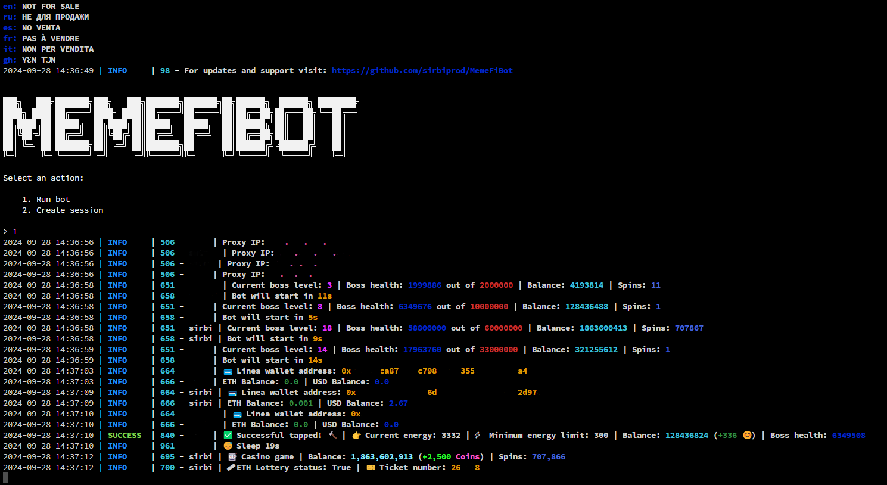

# HiddenCode - [https://t.me/hidden_coding](https://t.me/+oBSaBMwFrx8zN2Vk)




# Must be [Python 3.10](https://www.python.org/downloads/release/python-3100/) and [PROXY](https://proxyline.net?ref=323946) (1 acc - 1 proxy)
# Use [promo code](https://proxyline.net?ref=323946) for 10% off proxies from Proxyline
```dockerignore
CMn8jX2sY3oMH6L4O4n
```

## Functionality

| Functional                                                     | Supported |
|----------------------------------------------------------------| :-------: |
| Purchasing TapBot                                              |    ✅     |
| Starting TapBot                                                |    ✅     |
| Claiming TapBot reward every 3 hours                           |    ✅     |
| Claiming Daily Combo                                           |    ✅     |
| Multithreading                                                 |    ✅     |
| Binding a proxy to a session                                   |    ✅     |
| Auto-purchase of items if you have coins (tap, energy, charge) |    ✅     |
| Random sleep time between clicks                               |    ✅     |
| Random number of clicks per request                            |    ✅     |
| Support pyrogram .session / telethon .session                  |    ✅     |
| Referral bonus claiming after first time registering           |    ✅     |
| Unique User Agent for each session                             |    ✅     |
| Bypassing Cloudflare protection                                |    ✅     |
| Possibility to specify a referral code                         |    ✅     |
| Displaying the linked Linea wallet                             |    ✅     |
| Display wallet balance in ETH and USD                          |    ✅     |
| Automated casino game                                          |    ✅     |
| Displaying the status and ticket number in the lottery         |    ✅     |
| Clear config customization with comments                       |    ✅     |
| Performing tasks on video                                      |    ✅     |


## [Settings](https://github.com/sirbiprod/MemeFiBot/blob/main/.env-example)

| Settings                      | Description                                                                                |
|-------------------------------|--------------------------------------------------------------------------------------------|
| **API_ID / API_HASH**         | Platform data from which to launch a Telegram session                                      |
| **MIN_AVAILABLE_ENERGY**      | Minimum amount of available energy, upon reaching which there will be a delay (default 300) |
| **SLEEP_BY_MIN_ENERGY**       | Delay when reaching minimum energy in seconds                                              |
| **ADD_TAPS_ON_TURBO**         | How many taps will be added when turbo is activated                                        |
| **AUTO_UPGRADE_TAP**          | Should I improve the tap                                                                   |
| **MAX_TAP_LEVEL**             | Maximum level of tap pumping                                                               |
| **AUTO_UPGRADE_ENERGY**       | Should I improve the tap                                                                   |
| **MAX_ENERGY_LEVEL**          | Maximum level of tap pumping                                                               |
| **AUTO_UPGRADE_CHARGE**       | Should I improve the tap                                                                   |
| **MAX_CHARGE_LEVEL**          | Maximum level of tap pumping                                                               |
| **APPLY_DAILY_ENERGY**        | Whether to use the daily free energy boost                                                 |
| **APPLY_DAILY_TURBO**         | Whether to use the daily free turbo boost                                                  |
| **RANDOM_CLICKS_COUNT**       | Random number of taps                                                                      |
| **SLEEP_BETWEEN_TAP**         | Random delay between taps in seconds                                                       |
| **USE_PROXY_FROM_FILE**       | Whether to use proxy from the `bot/config/proxies.txt`                                 |
| **AUTO_BUY_TAPBOT**           | Whether to purchase tapbot automatically                                                   |
| **ROLL_CASINO**               | Whether to use the casino                                                                  
| **VALUE_SPIN**                | Number of spins (multiplier)                                                               
| **LOTTERY_INFO**              | Displaying lottery information                                                  
| **LINEA_WALLET**              | Showing Linea purse 
| **LINEA_API**                 | Linea API key to request balance information
| **USE_RANDOM_DELAY_IN_RUN**   | Using different startup times for accounts
| **RANDOM_DELAY_IN_RUN**       | Delay range for starting accounts
| **REF**                       | Referral code activation 
| **REF_ID**                    | Referral code
| **WATCH_VIDEO**               | Automatic job execution

## Installation

You can download [**Repository**](https://github.com/sibiprod/MemeFiBot) by cloning it to your system and installing the necessary dependencies:

```shell
~ >>> git clone https://github.com/sirbiprod/MemeFiBot.git
~ >>> cd MemeFiBot

#Linux and MacOS
1. ~/MemeFiBot >>> bash install.sh
2. ~/MemeFiBot >>> bash run.sh

#Windows
1. Run install.bat
2. Run START.bat

OR

~/MemeFiBot >>> python3 -m venv venv
~/MemeFiBot >>> source venv/bin/activate
~/MemeFiBot >>> pip3 install -r requirements.txt
~/MemeFiBot >>> cp .env-example .env
~/MemeFiBot >>> nano .env # Here you must specify your API_ID and API_HASH , the rest is taken by default
~/MemeFiBot >>> python3 main.py

#Windows
1. Double click on INSTALL.bat in MemeFiBot directory to install the dependencies
2. Double click on START.bat in MemeFiBot directory to start the bot

OR

~/MemeFiBot >>> python -m venv venv
~/MemeFiBot >>> venv\Scripts\activate
~/MemeFiBot >>> pip install -r requirements.txt
~/MemeFiBot >>> copy .env-example .env
~/MemeFiBot >>> # Specify your API_ID and API_HASH, the rest is taken by default
~/MemeFiBot >>> python main.py
```

Also for quick launch you can use arguments, for example:

```shell
~/MemeFiBot >>> python3 main.py --action (1/2)
# Or
~/MemeFiBot >>> python3 main.py -a (1/2)

#1 - Run bot
#2 - Create session
```

## Acknowledgments

- [Shamhi](https://github.com/shamhi)
