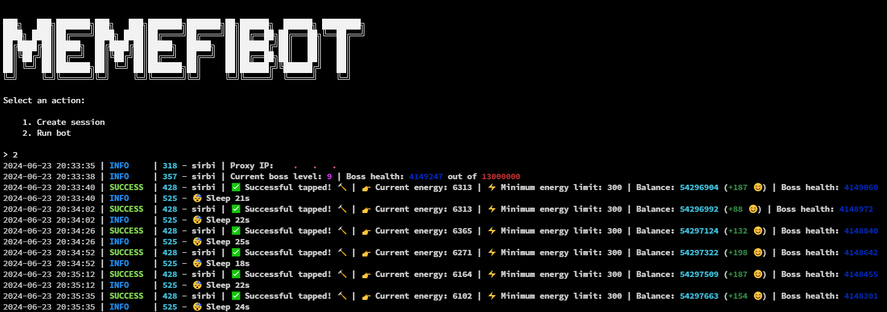

> README на русском доступен [здесь](README-RU.md)




# Use Python 3.10

## Functionality

| Functional                                                     | Supported |
| -------------------------------------------------------------- | :-------: |
| Purchasing TapBot                                              |    ✅     |
| Starting TapBot                                                |    ✅     |
| Claiming TapBot reward every 3 hours                           |    ✅     |
| Claiming Daily Combo                                           |    ✅     |
| Multithreading                                                 |    ✅     |
| Binding a proxy to a session                                   |    ✅     |
| Auto-purchase of items if you have coins (tap, energy, charge) |    ✅     |
| Random sleep time between clicks                               |    ✅     |
| Random number of clicks per request                            |    ✅     |
| Support tdata / pyrogram .session / telethon .session          |    ✅     |
| Referral bonus claiming after first time registering           |    ✅     |

## [Settings](https://github.com/FreddyWhest/MemeFiBot/blob/main/.env-example)

| Settings                 | Description                                                                                 |
| ------------------------ | --------------------------------------------------------------------------------------------|
| **API_ID / API_HASH**    | Platform data from which to launch a Telegram session (stock - Android)                     |
| **MIN_AVAILABLE_ENERGY** | Minimum amount of available energy, upon reaching which there will be a delay (default 300) |
| **SLEEP_BY_MIN_ENERGY**  | Delay when reaching minimum energy in seconds (eg 314)                                      |
| **ADD_TAPS_ON_TURBO**    | How many taps will be added when turbo is activated (eg 2000)                               |
| **AUTO_UPGRADE_TAP**     | Should I improve the tap (True / False) (default False)                                     |
| **MAX_TAP_LEVEL**        | Maximum level of tap pumping (eg 5)                                                         |
| **AUTO_UPGRADE_ENERGY**  | Should I improve the tap (True / False)  (default False)                                    |
| **MAX_ENERGY_LEVEL**     | Maximum level of tap pumping (eg 5)                                                         |
| **AUTO_UPGRADE_CHARGE**  | Should I improve the tap (True / False)  (default False)                                    |
| **MAX_CHARGE_LEVEL**     | Maximum level of tap pumping (eg 5)                                                         |
| **APPLY_DAILY_ENERGY**   | Whether to use the daily free energy boost (True / False)  (default True)                   |
| **APPLY_DAILY_TURBO**    | Whether to use the daily free turbo boost (True / False)   (default True)                   |
| **RANDOM_CLICKS_COUNT**  | Random number of taps     (default [5, 23] )                                                |
| **SLEEP_BETWEEN_TAP**    | Random delay between taps in seconds (default [15, 25] )                                    |
| **USE_PROXY_FROM_FILE**  | Whether to use proxy from the `bot/config/proxies.txt` file (True / False)                  |
| **AUTO_BUY_TAPBOT**      | Whether to purchase tapbot automatically (True / False)                                     |

## Installation

You can download [**Repository**](https://github.com/sibiprod/MemeFiBot) by cloning it to your system and installing the necessary dependencies:

```shell
~ >>> git clone https://github.com/sibiprod/MemeFiBot.git
~ >>> cd MemeFiBot

#Linux and MocOS
1. Double click on install.sh in MemeFiBot directory to install the dependencies
2. bash run.sh

OR

~/MemeFiBot >>> python3 -m venv venv
~/MemeFiBot >>> source venv/bin/activate
~/MemeFiBot >>> pip3 install -r requirements.txt
~/MemeFiBot >>> cp .env-example .env
~/MemeFiBot >>> nano .env # Here you must specify your API_ID and API_HASH , the rest is taken by default
~/MemeFiBot >>> python3 main.py

#Windows
1. Double click on INSTALL.bat in MemeFiBot directory to install the dependencies
2. Double click on START.bat in MemeFiBot directory to start the bot

OR

~/MemeFiBot >>> python -m venv venv
~/MemeFiBot >>> venv\Scripts\activate
~/MemeFiBot >>> pip install -r requirements.txt
~/MemeFiBot >>> copy .env-example .env
~/MemeFiBot >>> # Specify your API_ID and API_HASH, the rest is taken by default
~/MemeFiBot >>> python main.py
```

Also for quick launch you can use arguments, for example:

```shell
~/MemeFiBot >>> python3 main.py --action (1/2)
# Or
~/MemeFiBot >>> python3 main.py -a (1/2)

#1 - Create session
#2 - Run clicker
```

## Acknowledgments

- [Shamhi](https://github.com/shamhi)
